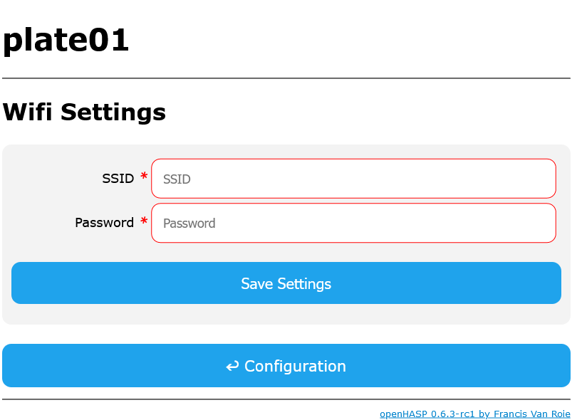

# Wifi Settings

When using a wireless network adapter, you need to configure the SSID to connect.

## Web UI



### SSID

The name of the access point to connect to.

### Password

Optional password for the access point, if required.

---

Click 'Save Settings' to save your settings to the device. A restart is required to make the settings active. Navigate back to the Main Menu and click Restart to activate the settings.


## Commandline

You can also configure the wifi settings via the serial or telnet console:

```bash
ssid myAccessPointName
pass myWifiPassword
reboot
```