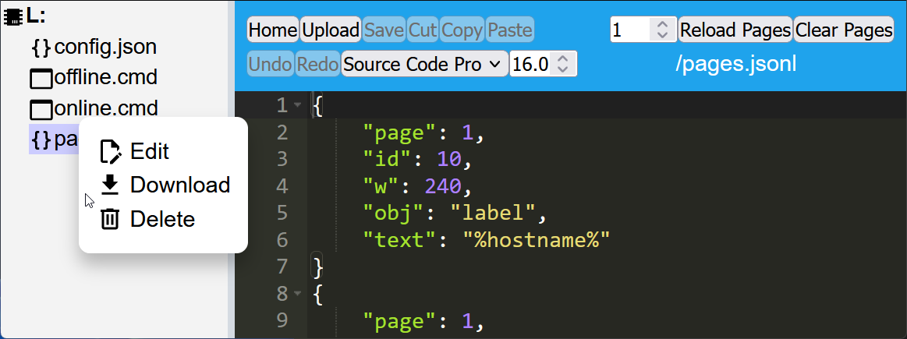

# File Editor

There is a file browser included in the web UI of the plate.
You can use it to upload, edit, download and delete files on the flash partition of the ESP32.

Click on the File Editor button on the Main Webpage:

## Upload Files

## Create Files

Type a new filename into the path field and click the Create button. The file will appear in the filelist.

For example, type `/pages.jsonl` and click Create button.

## Edit Files

To change the Font size or settings of the Editor, click inside the text field and type ++f1++.

## Save Files

To save changes in the File Editor to flash type ++ctrl+"S"++ on a PC or ++cmd+"S"++ on Mac.

## Delete Files

Right-click on any file in the list and select Delete from the pop-up menu to remove that file from the ESP32 filesystem.

