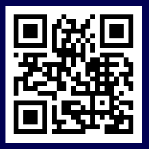

# QR-Code
**obj:`qrcode`**



| Property | Value      | Default | Description
|----------|------------|---------|--------------------------
| text  | [string][10]     | ""      | The text to encode to QR code
| size  | [int16][9]      | 140      | The object is always a square with a width and a height that correspond to size.


???+ example "Example `jsonl`"
    ```json linenums="1"
    {"page":1,"id":42,"obj":"qrcode","text":"www.openhasp.com/0.7.0/design/objects/","x":520,"y":20,"size":200}
    ```

!!! note :
    The maximum text length depends on the QR code version. By default, the maximum version 7 is used, which corresponds to a maximum text length of 122 characters.

   
[1]: ../../data-types/#colors
[2]: ../../data-types/#boolean
[3]: ../../../configuration/gpio/#groupid
[4]: ../../styling/#general
[5]: ../../styling/#image
[6]: ../../styling/#value
[7]: ../../styling/#line
[8]: ../../styling/#scale
[9]: ../../data-types/#integer
[10]: ../../data-types/#string
[11]: ../../data-types/#json-object
[12]: ../../styling/
[13]: ../../styling/#padding-and-margin
[14]: ../../styling/#text
[15]: ../../data-types/#variables
[16]: https://lvgl.io/tools/imageconverter
[17]: ../../../integrations/home-assistant/sampl_conf/#using-tags
[18]: ../../styling/#parts
