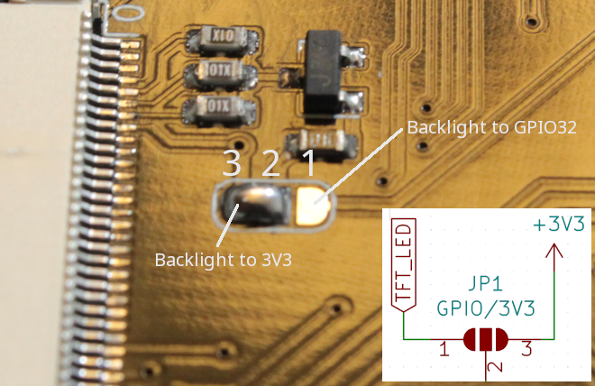

# ESP32 TouchDown

<div class="row justify-content-center">
        <a href="../images/esp32-touchdown.jpg" data-toggle="lightbox" data-gallery="example-gallery" class="col-sm-6" data-title="ESP32 TouchDown" data-footer="Original image by Dustin Watts - Used with permission">
            
        </a>

        <a href="../images/esp32-touchdown-color_wheel.png" data-toggle="lightbox" data-gallery="example-gallery" class="col-sm-6" data-title="ESP32 TouchDown" data-footer="Original image by Dustin Watts - Used with permission">
            
        </a>
</div>
<div>
        <a href="../images/esp32-touchdown-usbc.jpg" data-toggle="lightbox" data-gallery="example-gallery" rel="lightbox[work]" data-title="ESP32 TouchDown" data-footer="Original image by Dustin Watts - Used with permission">more images...</a>
        <a href="../images/esp32-touchdown-speaker.jpg" data-toggle="lightbox" data-gallery="example-gallery" rel="lightbox[vacation]" data-title="ESP32 TouchDown" data-footer="Original image by Dustin Watts - Used with permission"></a>
        <a href="../images/esp32-touchdown-sdcard.jpg" data-toggle="lightbox" data-gallery="example-gallery" rel="lightbox[vacation]" data-title="ESP32 TouchDown" data-footer="Original image by Dustin Watts - Used with permission"></a>
        <a href="../images/esp32-touchdown-features.png" data-toggle="lightbox" data-gallery="example-gallery" rel="lightbox[vacation]" data-title="ESP32 TouchDown" data-footer="Original image by Dustin Watts - Used with permission"></a>
</div>


## Features

   - ESP32-WROOM-32D
   - ILI9488 3.5" (480*320) TFT screen in 4-wire SPI mode
   - FT62x6 Capacitive Touch Controller
   - APK2112 3.3V regulator
   - MCP73831 battery management IC
   - CP2102 USB-to-UART IC
   - USB-C connector
   - Piezo Speaker
   - microSD card holder
   - Battery voltage divider connected to GPIO35
   - Stemma / JST-PH I2C connector
   - Compact size: 100x57x15mm

This board was originaly created for the [FreeTouchDeck project](https://github.com/DustinWatts/FreeTouchDeck)
and the hardware is also open source. Due to the extensive documentation it was easy to port openHASP to the ESP32-Touchdown.

| Pros              | Cons
|:-----             |:----
| 480x320 display   | 4 MB flash
| Capactitive touch | No PSram
| Battery connector |
| Battery sensor    |

The speaker and SD card are not supported by openHASP {< openhasp.version >}.

!!! info
    Any 3.7V (nominal voltage) LiPo will work, 2000mAh battery should suffice. Be sure to have the correct polarity.
    If the connecter at the end of the battery does not match, gently remove the pins from the connector and put them back in the correct orientation.

Available from:</br>
[:material-cart-variant: Tindie][1]{target=_blank .md-button .md-button--primary } &nbsp; 
[:material-cart-variant: Eplop (UK)][2]{target=_blank .md-button .md-button--primary } &nbsp; 
[:material-cart-variant: PCBway][3]{target=_blank .md-button .md-button--primary }

## Product Video

<div class="embed-responsive embed-responsive-16by9" style="max-width:560px; margin:auto;">
    <iframe title="YouTube video player" src="https://www.youtube.com/embed/TJTbuOdeoFw?rel=0&controls=1" class="embed-responsive-item" frameborder="0" allow="accelerometer; clipboard-write; encrypted-media; gyroscope; picture-in-picture" allowfullscreen>
    </iframe>
</div>

## Backlight Control

To enable backlight control, make sure the solder jumper pad is in position 2-1:



## 3D Printed Cases

You can find several different [3D printable cases](https://github.com/DustinWatts/esp32-touchdown/tree/main/Case) in the [ESP32 TouchDown repository](https://github.com/DustinWatts/esp32-touchdown/):

## Flashing

The ESP32 TouchDown can easily be flashed over USB like any ESP32 development board.

## GPIO Settings

These pins can be used freely as GPIOs:

## PCB Blueprint

The ESP32 TouchDown is fully [Open Source Hardware](https://github.com/DustinWatts/esp32-touchdown/tree/main/Hardware):

- Schematics
- Bill of materials
- PCB layout
- Datasheets


## HASP build_flags

Specify the LCD Configuration to use and define the GPIOs in the environment build flags:

```ini linenums="1"
build_flags =
    ${env.build_flags}
    ${esp32.build_flags}
    ${esp32.vspi}        ; Use VSPI hardware SPI bus

;region -- TFT_eSPI build options ------------------------
    -D USER_SETUP_LOADED=1
    -D ILI9488_DRIVER=1
    -D TFT_ROTATION=0 ; 0=0, 1=90, 2=180 or 3=270 degree
    -D TFT_WIDTH=320
    -D TFT_HEIGHT=480
    -D TFT_CS=15  ;// Chip select control pin
    -D TFT_DC=2  ;// Data Command control pin
    -D TFT_RST=4 ;// Reset pin (could connect to RST pin)
    -D TFT_BCKL=5  ;None, configurable via web UI (e.g. 2 for D4)
    -D SUPPORT_TRANSACTIONS
    -D TOUCH_DRIVER=6336 ; XPT2606 Resistive touch panel driver 
    -D TOUCH_SDA=21
    -D TOUCH_SCL=22
    -D TOUCH_IRQ=27   ; not connected
    -D TOUCH_RST=-1   ; not used, connected to 3.3V
    -D TOUCH_FREQUENCY=400000
    -D SPI_FREQUENCY=27000000
    -D SPI_READ_FREQUENCY=16000000
;endregion
```

[1]: https://www.tindie.com/products/dustinwattsnl/esp32-touchdown/
[2]: https://store.eplop.co.uk/product/esp32touchdown/
[3]: https://www.pcbway.com/project/gifts_detail/ESP32_TouchDown.html