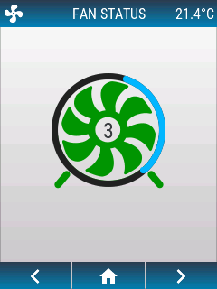

<h1>Animated fan status</h1>

<h2>Layout</h2>




<h2>Code</h2>

To add an openHASP plate to your installation with a sample design to control and reflect the status of a fan:

- in the plate's web UI select `Hasp Light` UI theme and reboot,
- upload the [fan icon](../../assets/users/noun_Fan_35097_140.png) to your plate,
- upload a `pages.jsonl` file with the folowing content to your plate and reboot:

```json
{"page":1,"id":1,"obj":"btn","x":0,"y":0,"w":240,"h":30,"text":"FAN STATUS","text_font":16,"bg_color":"#2C3E50","text_color":"#FFFFFF","radius":0,"border_side":0,"click":0}

{"page":1,"id":11,"obj":"img","src":"L:/noun_Fan_35097_140.png","auto_size":1,"w":140,"h":140,"x":50,"y":75,"image_recolor":"lime","image_recolor_opa":150}
{"page":1,"id":13,"obj":"spinner","parentid":11,"x":7,"y":6,"w":126,"h":126,"bg_opa":0,"border_width":0,"line_width":7,"line_width1":7,"type":2,"angle":120,"speed":1000,"value_str":3}

```

This is made from a transparent [PNG image](../../../design/objects/#image) and a [spinner](../../../design/objects/#spinner) object placed on top of it. To reflect various states of the fan from your home automation system, you could change the `speed` of the spinner, the `value_str` to display it numerically, or `line_color1` to colorize it. You can use `image_recolor` and `image_recolor_opa` from the [image styling](../../../design/styling/#image) properties to apply a color overlay mask to the fan itself.


Check out the [pagination example](../example-pagination) to learn how to implement the bottom bar.  
Check out the [clock and temperature example](../../home-assistant/sampl_conf/#display-clock-and-temperature) to learn how to implement values to the top.  

!!! note "Attribution" 
    Fan by WARPAINT Media Inc. from the [Noun Project](https://thenounproject.com/search/?q=fan+spinning&i=35097)

