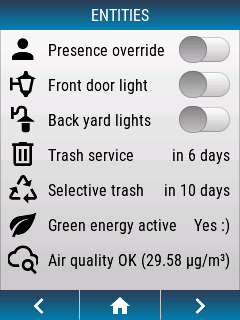

---
hide:
  - toc
---

# Lovelace-like Entities

## Layout




## Code

To add an openHASP plate to your installation with a sample design looking a bit like Home Assistant's Lovelace UI:

- in the plate's web UI select `Hasp Light` UI theme and reboot,
- upload a `pages.jsonl` file with the folowing content to your plate and reboot:


```json linenums="1"
{"page":1,"id":1,"obj":"btn","x":0,"y":0,"w":240,"h":30,"text":"ENTITIES","value_font":22,"bg_color":"#2C3E50","text_color":"#FFFFFF","radius":0,"border_side":0,"click":0}
{"page":1,"id":2,"obj":"obj","x":5,"y":35,"w":230,"h":250,"click":0}

{"page":1,"id":11,"obj":"label","x":8,"y":33,"w":35,"h":35,"text":"\uE004","align":1,"text_font":32,"text_color":"black"}
{"page":1,"id":12,"obj":"label","x":48,"y":43,"w":130,"h":30,"text":"Presence override","align":0,"text_font":16,"text_color":"black"}
{"page":1,"id":13,"obj":"switch","x":177,"y":40,"w":50,"h":25,"radius":25,"radius20":15}

{"page":1,"id":21,"obj":"label","x":8,"y":69,"w":35,"h":35,"text":"\uF020","align":1,"text_font":32,"text_color":"black"}
{"page":1,"id":22,"obj":"label","x":48,"y":79,"w":130,"h":30,"text":"Front door light","align":0,"text_font":16,"text_color":"black"}
{"page":1,"id":23,"obj":"switch","x":177,"y":74,"w":50,"h":25,"radius":25,"radius20":15}

{"page":1,"id":31,"obj":"label","x":8,"y":103,"w":35,"h":35,"text":"\uF054","align":1,"text_font":32,"text_color":"black"}
{"page":1,"id":32,"obj":"label","x":48,"y":113,"w":130,"h":30,"text":"Back yard lights","align":0,"text_font":16,"text_color":"black"}
{"page":1,"id":33,"obj":"switch","x":177,"y":110,"w":50,"h":25,"radius":25,"radius20":15}

{"page":1,"id":41,"obj":"label","x":8,"y":138,"w":35,"h":35,"text":"\uEA7A","align":1,"text_font":32,"text_color":"black"}
{"page":1,"id":42,"obj":"label","x":48,"y":148,"w":130,"h":30,"text":"Trash service","align":0,"text_font":16,"text_color":"black"}
{"page":1,"id":43,"obj":"label","x":97,"y":148,"w":130,"h":30,"text":"in 6 days","align":2,"text_color":"black"}

{"page":1,"id":51,"obj":"label","x":8,"y":173,"w":35,"h":35,"text":"\uF39D","align":1,"text_font":32,"text_color":"black"}
{"page":1,"id":52,"obj":"label","x":48,"y":183,"w":130,"h":30,"text":"Selective trash","align":0,"text_font":16,"text_color":"black"}
{"page":1,"id":53,"obj":"label","x":97,"y":183,"w":130,"h":30,"text":"in 10 days","align":2,"text_color":"black"}

{"page":1,"id":61,"obj":"label","x":8,"y":208,"w":35,"h":35,"text":"\uE32A","align":1,"text_font":32,"text_color":"black"}
{"page":1,"id":62,"obj":"label","x":48,"y":218,"w":130,"h":30,"text":"Green energy active","align":0,"text_font":16,"text_color":"black"}
{"page":1,"id":63,"obj":"label","x":97,"y":218,"w":130,"h":30,"text":"Yes :)","align":2,"text_color":"black"}

{"page":1,"id":71,"obj":"label","x":8,"y":243,"w":35,"h":35,"text":"\uE957","align":1,"text_font":32,"text_color":"black"}
{"page":1,"id":72,"obj":"label","x":48,"y":253,"w":130,"h":30,"text":"Air quality","align":0,"text_font":16,"text_color":"black"}
{"page":1,"id":73,"obj":"label","x":97,"y":253,"w":130,"h":30,"text":"OK (29.58 µg/m³)","align":2,"text_color":"black"}
```

Check out the [pagination example](../example-pagination) to learn how to implement the bottom bar.  
Check out the [clock and temperature example](../../home-assistant/sampl_conf/#display-clock-and-temperature) to learn how to implement values to the top.  
Check out the [Lovelace cover example](../../home-assistant/sampl_conf/#covers-like-in-lovelace) to learn how to bring life to the objects.  
