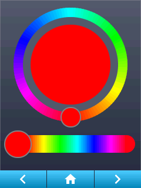

<h1>Widgets Demo</h1>

<h2>Page Layout</h2>





<h2>Code</h2>

This is a real-world example of a `pages.jsonl` file. Upload it to your plate's flash memory and restart the plate:

```json linenums="1"
{"page":1,"comment":"---------- Page 1 ----------"}
{"id":1,"obj":"btn","x":10,"y":45,"w":220,"h":55,"toggle":true,"text":"Touch me \uE96B","text_font":32}
{"id":2,"obj":"checkbox","x":10,"y":100,"w":220,"h":55,"text":" My Checkbox"}
{"id":3,"obj":"label","x":10,"y":10,"w":220,"h":30,"text":"\uE75A My Label","align":1,"padh":50}
{"id":4,"obj":"switch","x":125,"y":220,"w":100,"h":55,"radius":40,"radius20":40}
{"id":5,"obj":"led","x":22,"y":220,"w":55,"h":55}
{"id":6,"obj":"dropdown","x":10,"y":160,"w":130,"options":"\uE40A Apples\n\uE40A Oranges\n\uE40A Bananas"}
{"id":7,"obj":"spinner","x":160,"y":140,"w":70,"h":70}

{"page":2,"comment":"---------- Page 2 ----------"}
{"id":1,"obj":"obj","x":5,"y":5,"w":230,"h":280,"click":0}
{"id":11,"obj":"gauge","x":10,"y":10,"w":150,"h":150,"val":75}
{"id":12,"obj":"linemeter","x":130,"y":120,"w":100,"h":100,"val":32}
{"id":13,"obj":"label","x":28,"y":65,"w":70,"h":70,"parentid":12,"text":"\uE12C OK"}
{"id":14,"obj":"bar","x":20,"y":225,"w":200,"h":20, "val":75}
{"id":15,"obj":"slider","x":20,"y":254,"w":200,"h":20,"val":25}

{"comment":"---------- Page 3 ----------"}
{"page":3,"id":1,"obj":"cpicker","page":3,"x":20,"y":10,"w":200,"h":200}
{"page":3,"id":2,"obj":"cpicker","page":3,"x":30,"y":230,"w":200,"h":30}

{"page":4,"comment":"---------- Page 4 ----------"}
{"id":1,"obj":"tabview","btn_pos":1}
{"id":10,"obj":"tab","parentid":1,"text":"Tab 1"}
{"id":20,"obj":"tab","parentid":1,"text":"Tab 2"}
{"id":30,"obj":"tab","parentid":1,"text":"Tab 3"}
{"id":11,"obj":"roller","x":40,"y":10,"w":160,"rows":2,"options":"2020\n2021\n2022\n2023\n2024","parentid":10}
{"id":12,"obj":"img","src":"L:/logo-medium.png","x":45,"y":80,"auto_size":1,"w":150,"parentid":10}

{"comment":"---------- All Pages ----------"}
{"page":0,"id":7,"obj":"btn","action":"prev","x":0,"y":290,"w":79,"h":32,"text":"\uE141","text_color":"#FFFFFF","radius":0,"border_side":0,"text_font":32}
{"page":0,"id":8,"obj":"btn","action":"back","x":80,"y":290,"w":80,"h":32,"text":"\uE2DC","text_color":"#FFFFFF","radius":0,"border_side":0,"text_font":24}
{"page":0,"id":9,"obj":"btn","action":"next","x":161,"y":290,"w":79,"h":32,"text":"\uE142","text_color":"#FFFFFF","radius":0,"border_side":0,"text_font":32}

{"comment":"---------- Limit page prev/next between 1 and 4 ----------"}
{"page":1,"id":0,"prev":4}
{"page":4,"id":0,"next":1}

```

Upload [this logo](https://raw.githubusercontent.com/HASwitchPlate/openHASP-docs/0.6/docs/assets/images/logo-medium.png) to the plate to see the `img` object.

!!! note
    Your MCU needs to have [on-board PSram](../../../getting-started/#recommended-boards) in order for the `img` object to be properly displayed.

