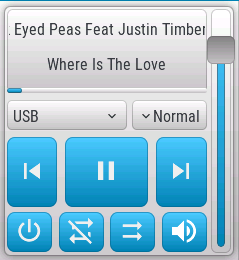
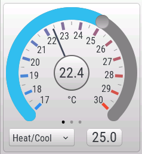

!!! note
    Some examples below may generate errors during Home Assistant startup. Log messages like `Error while processing template` or `Template variable error: 'None' has no attribute 'last_changed'` etc. can be caused by the fact that openHASP component loads faster than the other integrations you have set up, from where you want to pull data. Because the data required by openHASP component is not yet available, an error is generated. But as soon as Home Assistant finishes loading everything, and all the data you've configured is available, things will be normal. Nevertheless the log should be checked regularly to find repetitive problems.

## Display clock and temperature


The easiest example is to display the state of a clock and a temperature sensor from Home Assistant, using _label_ objects in openHASP.

Create a label object to display the temperature value, a separate label object to display the unit and a third label object for the clock:

```json
{"page":0,"id":4,"obj":"label","x":175,"y":5,"h":30,"w":45,"text":"00.0","align":2,"bg_color":"#2C3E50"}
{"page":0,"id":5,"obj":"label","x":220,"y":5,"h":30,"w":45,"text":"°C","align":0,"bg_color":"#2C3E50"}
{"page":0,"id":6,"obj":"label","x":3,"y":5,"h":30,"w":62,"text":"00:00","align":0,"bg_color":"#2C3E50"}
```

In component configuration all you need for the objects is:

```yaml
    objects:
      - obj: "p0b4"
        properties:
          "text": "{{ states('sensor.my_room_temperature') }}"
      - obj: "p0b6"
        properties:
          "text": "{{ states('sensor.time') }}"
```

#### Note:
You can of course omit the second label object with the unit and use the same for both value and unit:

```json
{"page":0,"id":4,"obj":"label","x":175,"y":5,"h":30,"w":62,"text":"00.0°C","align":2,"bg_color":"#2C3E50"}
{"page":0,"id":6,"obj":"label","x":3,"y":5,"h":30,"w":62,"text":"00:00","align":0,"bg_color":"#2C3E50"}
```

In component configuration you will add the unit to the value using the template:

```yaml
    objects:
      - obj: "p0b4"
        properties:
          "text": "{{ states('sensor.my_room_temperature') }}°C"
```

All these being on page 0 means that they will appear on all the pages.

*  *  *  *  *

## Some basic controls

Jsonl and Home Assistant configuration:

#### Toggle a light (or any switchable entity with on/off states)


```json
{"page":1,"id":2,"obj":"btn","x":10,"y":40,"w":105,"h":90,"toggle":true,"text":"\uE335","text_font":32,"align":1}
```

```yaml
      - obj: "p1b2" # switch, checkbox or btn with toggle true
        properties:
          "val": '{{ 1 if is_state("light.my_lamp", "on") else 0 }}'
          "text": '{{ "\uE6E8" if is_state("light.my_lamp", "on") else "\uE335" | e }}'
        event:
          "down":
            - service: homeassistant.toggle
              entity_id: "light.my_lamp"
```

#### Dropdown (self-populating from an input_select)

```json
{"page":1,"id":3,"obj":"dropdown","x":5,"y":40,"w":230,"h":30,"options":""}
```

```yaml
      - obj: "p1b3" # dropdown
        properties:
          "options": >
            {{item+"\n"|e}}
          "val": >
            
            {{loop.index -1 if item == states('input_select.my_dropdown_selections') }}
            
        event:
          "changed":
            - service: input_select.select_option
              data:
                option: '{{ text }}'
              target:
                entity_id: input_select.my_dropdown_selections
            - service: persistent_notification.create
              data:
                message: Selected {{ text }}
```

*  *  *  *  *

## Color coded icons


<h4>Color code a WiFi icon according to RSSI reported by the plate</h4>

**openHASP config:** (screen size 240x320) 

```json
{"obj":"btn","id":1,"x":120,"y":1,"w":30,"h":40,"text_font":"2","text":"\uE5A9","text_color":"gray","bg_opa":0,"border_width":0}
```

relevant **openHASP-custom-component config:**

```yaml
    - obj: "p0b1"
      properties:
        "text_color": "greenorangetomatored"
```

<h4>Color code a temperature icon according to sensor values</h4>

**openHASP config:** (screen size 240x320) 

```json
{"obj":"btn","id":3,"x":165,"y":1,"w":30,"h":40,"text_font":"2","text":"\uE50F","text_color":"gray","bg_opa":0,"border_width":0}
```

relevant **openHASP-custom-component config:**

```yaml
    - obj: "p0b3"
      properties:
        "text_color": "#4682B4greenred"
```


*  *  *  *  *

## Light brightness and color


Have a light in Home Assistant controlled by openHASP. In our example we use Lanbon L8's moodlight which has both brightness and color - we use a [slider](../../../design/objects#slider) object for the brightness, and a [cpicker](../../../design/objects#color-picker) object for color.

relevant **openHASP config:**

```json
{"page":1,"id":31,"obj":"slider","x":6,"y":15,"w":14,"h":180,"min":1,"max":255}
{"page":1,"id":32,"obj":"cpicker","x":30,"y":10,"w":180,"h":180}
```

relevant **openHASP-custom-component config:**

```yaml
      - obj: "p1b31" # Light brightness
        properties:
          "val": "{{ state_attr('light.plate_moodlight', 'brightness') if state_attr('light.plate_moodlight', 'brightness') != None else 0 }}"
        event:
          "changed":
            - service: light.turn_on
              data:
                entity_id: light.plate_moodlight
                brightness:  "{{ val }}"
          "up":
            - service: light.turn_on
              data:
                entity_id: light.plate_moodlight
                brightness:  "{{ val }}"

      - obj: "p1b32" # Light color
        properties:
          "color": >
            
            
            {{ "#%02x%02x%02x" | format(rgb[0],rgb[1],rgb[2]) }}
            
        event:
          "up":
            - service: light.turn_on
              data:
                entity_id: light.plate_moodlight
                rgb_color: "[{{ r }},{{ g }},{{ b }}]"

```
The brightness slider value gets updated from the `brightness` attribute of `light.plate_moodlight`, while it's on. If it's off, that attribute is removed by Home Assistant, in that case we set it to `0`.

The `color` property gets updated from the `rgb_color` attriburte of the light. The R, G and B decimal color values are converted to hexadecimal html color code using a template whenever the color of the light changes in Home Assistant.

When somebody changes the color of the picker object on the page, the light in Home Assistant gets updated with `rgb_color` values received in the MQTT message from the plate.

*  *  *  *  *

## Cover with state feedback

  


The icon on the up and down buttons change color when covers move and set opacity when reached to limit. UI theme set to `Hasp Light` in plate's web interface. 

relevant **openHASP config:** (screen size 240x320) 

```json
{"page":1,"id":4,"obj":"btn","x":5,"y":140,"w":73,"h":60,"toggle":false,"text":"\uE05D","text_font":32}
{"page":1,"id":5,"obj":"btn","x":83,"y":140,"w":73,"h":60,"toggle":false,"text":"\uE4DB","text_font":32}
{"page":1,"id":6,"obj":"btn","x":161,"y":140,"w":73,"h":60,"toggle":false,"text":"\uE045","text_font":32}
```

relevant **openHASP-custom-component config:**

```yaml
      - obj: "p1b4"
        properties:
          "text_color": "{{ '#FFFF00' if is_state('cover.cover_1', 'opening') else '#FFFFFF' }}"
          "text_opa": "{{ '80' if is_state_attr('cover.cover_1','current_position', 100) else '255' }}"
        event:
          "down":
            - service: cover.open_cover
              target:
                entity_id: "cover.cover_1"
      - obj: "p1b5"
        properties:
          "text": >
            
            {{ "\uE4DB" | e }}
            
            {{ "\uE4DB" | e }}
            
            {{ "\uF11C" | e }}
            
            {{ "\uF11E" | e }}
            
        event:
          "down":
            - service: cover.stop_cover
              target:
                entity_id: "cover.cover_1"
      - obj: "p1b6"
        properties:
          "text_color": "{{ '#FFFF00' if is_state('cover.cover_1', 'closing') else '#FFFFFF' }}"
          "text_opa": "{{ '80' if is_state_attr('cover.cover_1','current_position', 0) else '255' }}"
        event:
          "down":
            - service: cover.close_cover
              target:
                entity_id: "cover.cover_1"
```

*  *  *  *  *

## Cover with button matrix

A simpler cover control with only basic feedback. UI theme set to `Hasp Light` in plate's web interface. 

relevant **openHASP config:** (screen size 240x320) 

```json
{"page":4,"id":20,"obj":"btnmatrix","x":0,"y":20,"w":240,"h":70,"options":["\uE05D","\uE4DB","\uE045"],"text_font":32,"bg_opa":0,"border_opa":0}
```

relevant **openHASP-custom-component config:**

```yaml
      - obj: "p4b20"
        properties:
          "options": >
            
            ["\uE05D","\uE4DB","#FFFF00 \uE045"]
            
            ["#FFFF00 \uE05D","\uE4DB","\uE045"]
            
            ["\uE05D","\uE4DB","\uE045"]
            
        event:
          "down":
            - service: >
                
                cover.open_cover
                
                cover.stop_cover
                
                cover.close_cover
                
              target:
                entity_id: cover.cover_1
```

*  *  *  *  *

## Covers like in Lovelace

  

The icon behaves like in Lovelace. UI theme set to `Hasp Light` in plate's web interface.

<video width="360" height="640" controls>
  <source src="../../../assets/videos/cc_sampl_cover_lovelace.mp4" type="video/mp4">
Your browser does not support the video tag.
</video>

Check out the [Lovelace-like entities](../examples/example-lovelace.md) for similar placement.  

relevant **openHASP config:** (screen size 240x320, UI Theme: Hasp Light) 

```json
{"page":5,"id":12,"obj":"label","x":8,"y":33,"w":35,"h":35,"text":"\uF11D","align":1,"text_font":32,"text_color":"#053248"}
{"page":5,"id":13,"obj":"label","x":48,"y":43,"w":80,"h":30,"text":"Cover 1","align":0,"text_font":16,"text_color":"#053248"}
{"page":5,"id":14,"obj":"btn","x":125,"y":37,"w":30,"h":30,"toggle":false,"text":"\uE05D","text_font":32,"bg_opa":0,"border_opa":0,"text_color":"#053248"}
{"page":5,"id":15,"obj":"btn","x":165,"y":37,"w":30,"h":30,"toggle":false,"text":"\uE4DB","text_font":32,"bg_opa":0,"border_opa":0,"text_color":"#053248"}
{"page":5,"id":16,"obj":"btn","x":205,"y":37,"w":30,"h":30,"toggle":false,"text":"\uE045","text_font":32,"bg_opa":0,"border_opa":0,"text_color":"#053248"}

{"page":5,"id":22,"obj":"label","x":8,"y":69,"w":35,"h":35,"text":"\uF11D","align":1,"text_font":32,"text_color":"#053248"}
{"page":5,"id":23,"obj":"label","x":48,"y":79,"w":80,"h":30,"text":"Cover 2","align":0,"text_font":16,"text_color":"#053248"}
{"page":5,"id":24,"obj":"btn","x":125,"y":73,"w":30,"h":30,"toggle":false,"text":"\uE05D","text_font":32,"bg_opa":0,"border_opa":0,"text_color":"#053248"}
{"page":5,"id":25,"obj":"btn","x":165,"y":73,"w":30,"h":30,"toggle":false,"text":"\uE4DB","text_font":32,"bg_opa":0,"border_opa":0,"text_color":"#053248"}
{"page":5,"id":26,"obj":"btn","x":205,"y":73,"w":30,"h":30,"toggle":false,"text":"\uE045","text_font":32,"bg_opa":0,"border_opa":0,"text_color":"#053248"}
```

relevant **openHASP-custom-component config:**

```yaml
      - obj: "p5b12"
        properties:
          "text": >
            
            {{ "\uE6C0" | e }}
            
            {{ "\uE6C3" | e }}
            
            {{ "\uF11C" | e }}
            
            {{ "\uF11E" | e }}
            
      - obj: "p5b14"
        event:
          "down":
            - service: cover.open_cover
              target:
                entity_id: "cover.my_cover"
      - obj: "p5b15"
        event:
          "down":
            - service: cover.stop_cover
              target:
                entity_id: "cover.my_cover"
      - obj: "p5b16"
        event:
          "down":
            - service: cover.close_cover
              target:
                entity_id: "cover.my_cover"
```

*  *  *  *  *

## Media player

  

The labels with artist and title are scrolling, the progressbar fills if the media player provides duration and playback position. The dropdown lists containing the available sources and sound modes of the player get populated automatically by the values existing on the player in Home Assistant, and also the actually selected source is in sync with it.

Player availability is shown by the opacity of the buttons. Player state (play/pause) is shown by the middle button, short pressing means pause, long-press means stop. Power state shown by color, repeat, shuffle and muted state shown by appropriate icons on the buttons.
UI theme set to `Hasp Light` in plate's web interface.

relevant **openHASP config:** (screen size 240x320) 

```json
{"page":6,"id":10,"obj":"obj","x":5,"y":35,"w":230,"h":250,"click":0,"bg_opa":0,"shadow_opa":140,"shadow_color":"black","shadow_width":20,"shadow_spread":0}
{"page":6,"id":11,"obj":"obj","x":8,"y":38,"w":200,"h":84,"click":0}
{"page":6,"id":12,"obj":"label","x":10,"y":48,"w":196,"h":30,"text":"-","mode":"scroll","align":1}
{"page":6,"id":13,"obj":"label","x":10,"y":83,"w":196,"h":30,"text":"-","mode":"scroll","align":1}
{"page":6,"id":14,"obj":"bar","x":8,"y":117,"w":200,"h":5,"min":0,"max":100,"border_opa":0,"pad_top":0,"pad_bottom":0,"pad_left":0,"pad_right":0}
{"page":6,"id":15,"obj":"dropdown","x":8,"y":129,"w":120,"h":30,"options":"Source1\nSource2\nSource3","direction":3,"max_height":300,"radius":5}
{"page":6,"id":16,"obj":"dropdown","x":133,"y":129,"w":75,"h":30,"options":"Jazz\nPop\nRock","direction":2,"radius":5}
{"page":6,"id":17,"obj":"btn","x":8,"y":166,"w":50,"h":70,"toggle":false,"text":"\uE4AE","text_font":32}
{"page":6,"id":18,"obj":"btn","x":66,"y":166,"w":83,"h":70,"toggle":false,"text":"\uE40A","text_font":32}
{"page":6,"id":19,"obj":"btn","x":157,"y":166,"w":51,"h":70,"toggle":false,"text":"\uE4AD","text_font":32}
{"page":6,"id":20,"obj":"slider","x":212,"y":38,"w":20,"h":244,"min":0,"max":100,"val":85}
{"page":6,"id":21,"obj":"btn","x":8,"y":241,"w":45,"h":40,"toggle":false,"text":"\uE425","text_font":32}
{"page":6,"id":22,"obj":"btn","x":60,"y":241,"w":45,"h":40,"toggle":false,"text":"\uE457","text_font":32}
{"page":6,"id":23,"obj":"btn","x":111,"y":241,"w":45,"h":40,"toggle":false,"text":"\uE49E","text_font":32}
{"page":6,"id":24,"obj":"btn","x":163,"y":241,"w":45,"h":40,"toggle":false,"text":"\uE57E","text_font":32}
```

relevant **openHASP-custom-component config:**

```yaml
      - obj: "p6b12" # artist label
        properties:
          "text": "{{ state_attr('media_player.sound_my_room1','media_artist') if state_attr('media_player.sound_my_room1','media_artist') else '-' }}"

      - obj: "p6b13" # title label
        properties:
          "text": "{{ state_attr('media_player.sound_my_room1','media_title') if state_attr('media_player.sound_my_room1','media_title') else '-' }}"

      - obj: "p6b15" # sources list
        properties:
          "options": >
            
            {{"(no source)\n"|e}}
            
            {{source+"\n"|e}}
          "val": >
            
            0
            
            {{loop.index if source == state_attr('media_player.sound_my_room1','source') }}
            
          "click": "{{ 'false' if (is_state('media_player.sound_my_room1','unavailable') or is_state('media_player.sound_my_room1','unknown')) else 'true' }}"
        event:
          "changed":
            - service: media_player.select_source
              data:
                entity_id: media_player.sound_my_room1
                source: "{{ text }}"

      - obj: "p6b16" # sound modes list
        properties:
          "options": >
            
            
            {{soundmode+"\n"|e}}
          "val": >
            
            {{loop.index -1 if source == state_attr('media_player.sound_my_room1','sound_mode') }}
            
          "click": "{{ 'false' if (is_state('media_player.sound_my_room1','unavailable') or is_state('media_player.sound_my_room1','unknown')) else 'true' }}"
        event:
          "changed":
            - service: media_player.select_sound_mode
              data:
                entity_id: media_player.sound_my_room1
                sound_mode: "{{ text }}"

      - obj: "p6b14" # progressbar
        properties:
          "max": "{{ state_attr('media_player.sound_my_room1','media_duration') | int }}"
          "val": "{{ state_attr('media_player.sound_my_room1','media_position') | int }}"

      - obj: "p6b18" # play/pause/stop
        properties:
          "text": >
            
            {{ "\uE3E4" | e }}
            
            {{ "\uE40A" | e }}
            
          "text_opa": "{{ '80' if (is_state('media_player.sound_my_room1','unavailable') or is_state('media_player.sound_my_room1','unknown')) else '255' }}"
        event:
          "down":
            - service: media_player.media_play_pause
              target:
                entity_id: media_player.sound_my_room1
          "long":
            - service: media_player.media_stop
              target:
                entity_id: media_player.sound_my_room1

      - obj: "p6b17" # prev
        properties:
          "text_opa": "{{ '80' if (is_state('media_player.sound_my_room1','unavailable') or is_state('media_player.sound_my_room1','unknown')) else '255' }}"
        event:
          "down":
            - service: media_player.media_previous_track
              target:
                entity_id: media_player.sound_my_room1

      - obj: "p6b19" # next
        properties:
          "text_opa": "{{ '80' if (is_state('media_player.sound_my_room1','unavailable') or is_state('media_player.sound_my_room1','unknown')) else '255' }}"
        event:
          "down":
            - service: media_player.media_next_track
              target:
                entity_id: media_player.sound_my_room1

      - obj: "p6b20" # volume slider
        properties:
          "val": "{{ state_attr('media_player.sound_my_room1','volume_level') * 100 | int }}"
          "click": "{{ 'false' if (is_state('media_player.sound_my_room1','unavailable') or is_state('media_player.sound_my_room1','unknown')) else 'true' }}"
        event:
          "changed":
            - service: media_player.volume_set
              data:
                entity_id: media_player.sound_my_room1
                volume_level: "{{ val | int / 100 }}"
          "up":
            - service: media_player.volume_set
              data:
                entity_id: media_player.sound_my_room1
                volume_level: "{{ val | int / 100 }}"

      - obj: "p6b21" # power
        properties:
          "text_color": "{{ '#B00000' if states('media_player.sound_my_room1') == 'off' else '#FFFFFF' }}"
          "text_opa": "{{ '80' if (is_state('media_player.sound_my_room1','unavailable') or is_state('media_player.sound_my_room1','unknown')) else '255' }}"
        event:
          "down":
            - service: media_player.toggle
              data:
                entity_id: media_player.sound_my_room1

      - obj: "p6b22" # repeat
        properties:
          "text": >
            
            {{ "\uE458" | e }}
            
            {{ "\uE456" | e }}
            
            {{ "\uE457" | e }}
            
          "text_opa": "{{ '80' if (is_state('media_player.sound_my_room1','unavailable') or is_state('media_player.sound_my_room1','unknown')) else '255' }}"
        event:
          "down":
            - service: media_player.repeat_set
              data:
                entity_id: media_player.sound_my_room1
                repeat: >
                  
                  all
                  
                  off
                  
                  one
                  

      - obj: "p6b23" # shuffle
        properties:
          "text": >
            
            {{ "\uE49D" | e }}
            
            {{ "\uE49E" | e }}
            
          "text_opa": "{{ '80' if (is_state('media_player.sound_my_room1','unavailable') or is_state('media_player.sound_my_room1','unknown')) else '255' }}"
        event:
          "down":
            - service: media_player.shuffle_set
              data:
                entity_id: media_player.sound_my_room1
                shuffle:  >
                  
                  false
                  
                  true
                  

      - obj: "p6b24" # mute
        properties:
          "text": >
            
            {{ "\uE75F" | e }}
            
            {{ "\uE57E" | e }}
            
          "text_opa": "{{ '80' if (is_state('media_player.sound_my_room1','unavailable') or is_state('media_player.sound_my_room1','unknown')) else '255' }}"
        event:
          "down":
            - service: media_player.volume_mute
              data:
                entity_id: media_player.sound_my_room1
                is_volume_muted:  >
                  
                  false
                  
                  true
                  
```
Note that the `val` value of the slider is multiplied and divided by 100 when read and set, because [LVGL only suppports integers](../../design/data-types#integer) for object values. By multiplying and dividing by 100, it becomes possible to set volume between 0 and 1 as required by Home Assistant.

*  *  *  *  *

## Generic thermostat/climate

  

This example is a bit more complex in the aspect that it uses several objects put on top of each other, and grouped toghether using the `parentid` parameter.  Special attention goes to an invisible [tabview](../../../design/objects#tabview) (exteding over the label dispaying the target temperarture) which allows for swiping between an on/off switch and dropdowns for setting the hvac and fan modes.

The target temperature can be set by dragging the arc handle, more precise +/- setting possible by short/long pressing the middle circle containing the current temperature (increasing/decreasing the value by the _temperature step_ defined by the climate entity). Note that the `min`, `max` and `val` values of the arc and gauge are multiplied and divided by 10 when set and read, because [LVGL only suppports integers](../../../design/data-types#integer) for object values. By multiplying and dividing by 10, it becomes possible to set decimal values for climate temperature. 

The number of the ticks on the gauge is determined from the `min`, `max` attributes of the configured climate, likewise the `hvac_modes` and `fan_modes` dropdowns. You can localise these using the `if-else` statements of the template in the configuration of the custom component.

The active area of the arc changes color based on the current hvac mode of the entity.    
UI theme set to `Hasp Light` in plate's web interface.

Note that the tab swiping dots (_p3b26_) are also handled by the custom component. Don't forget update the service call in the configuration with your plate's MQTT node name, and the command parameters if you change the page of the objects.

<video width="360" height="640" controls>
  <source src="../../../assets/videos/cc_sampl_climate_control.mp4" type="video/mp4">
Your browser does not support the video tag.
</video>

relevant **openHASP config:** (screen size 240x320) 

```json
{"page":3,"id":10,"obj":"obj","x":5,"y":35,"w":230,"h":250,"click":0}
{"page":3,"id":10,"obj":"obj","x":5,"y":35,"w":230,"h":250,"click":0}
{"page":3,"id":20,"obj":"arc","x":5,"y":37,"w":230,"h":230,"min":170,"max":300,"val":250,"border_side":0,"type":0,"rotation":0,"start_angle":135,"end_angle":45,"adjustable":"true","line_width":21,"line_width1":21,"line_color1":"#34bdeb","bg_opa":0,"pad_top2":5,"pad_bottom2":5,"pad_left2":5,"pad_right2":5,"pad_top":5,"pad_bottom":5,"pad_left":5,"pad_right":5}
{"page":3,"id":21,"obj":"gauge","x":28,"y":28,"w":175,"h":175,"parentid":20,"min":170,"max":300,"val":224,"format":1,"critical_value":301,"label_count":14,"line_count":27,"border_width":0,"pad_top":2,"pad_bottom":2,"pad_left":2,"pad_right":2,"value_str":"°C","value_ofs_y":55,"value_font":16,"bg_opa":0,"line_width2":3,"line_rounded2":1,"line_color":"#348feb","line_color1":"#348feb","scale_grad_color":"#eb4934","scale_grad_color1":"#eb4934","scale_end_color1":"#eb4934"}
{"page":3,"id":22,"obj":"obj","x":85,"y":85,"w":60,"h":60,"parentid":20,"click":0,"radius":30,"border_width":2,"border_opa":200}
{"page":3,"id":23,"obj":"label","x":80,"y":100,"w":70,"h":30,"parentid":20,"text":"22.4","text_font":24,"align":"center"}
{"page":3,"id":24,"obj":"obj","x":145,"y":245,"w":60,"h":30,"click":0,"radius":5}
{"page":3,"id":25,"obj":"label","x":145,"y":245,"w":60,"h":30,"text":"25","text_font":24,"align":"center"}
{"page":3,"id":26,"obj":"label","x":90,"y":220,"w":60,"h":30,"text":"#909090 \u2022# #000000 \u2022# #909090 \u2022#","text_font":24,"align":"center","text_color":"grey","border_width":0}
{"page":3,"id":30,"obj":"tabview","x":0,"y":235,"w":240,"h":80,"btn_pos":0,"bg_opa":0,"border_width":0,"radius":0}
{"page":3,"id":31,"obj":"tab","parentid":30}
{"page":3,"id":32,"obj":"tab","parentid":30}
{"page":3,"id":33,"obj":"tab","parentid":30}
{"page":3,"id":41,"obj":"switch","x":35,"y":10,"w":60,"h":30,"parentid":31,"radius":25,"radius2":25}
{"page":3,"id":42,"obj":"dropdown","x":15,"y":10,"w":110,"h":30,"parentid":32,"options":"fan_modes","direction":"1","radius":5}
{"page":3,"id":43,"obj":"dropdown","x":15,"y":10,"w":110,"h":30,"parentid":33,"options":"hvac_modes","direction":"1","radius":5}
```

relevant **openHASP-custom-component config:**

```yaml
      - obj: "p3b20"  # arc slider
        properties:
          "val": "{{ state_attr('climate.thermostat_1','temperature') * 10 | int if not (is_state('climate.thermostat_1','unavailable')) }}"
          "min": "{{ state_attr('climate.thermostat_1','min_temp') * 10 | int if not (is_state('climate.thermostat_1','unavailable')) }}"
          "max": "{{ state_attr('climate.thermostat_1','max_temp') * 10 | int if not (is_state('climate.thermostat_1','unavailable')) }}"
          "line_color1": >
            
            {{ "#346beb" }}
            
            {{ "#34bdeb" }}
            
            {{ "#eb3434" }}
            
            {{ "#ebeb34" }}
            
            {{ "#34eb77" }}
            
            {{ "#9f96b0" }}
            
        event:
          "changed":
            - service: climate.set_temperature
              target:
                entity_id: climate.thermostat_1
              data:
                temperature: "{{ val | int / 10 }}"
          "up":
            - service: climate.set_temperature
              target:
                entity_id: climate.thermostat_1
              data:
                temperature: "{{ val | int / 10 }}"

      - obj: "p3b21"  # gauge current temp
        properties:
          "val": "{{ state_attr('climate.thermostat_1','current_temperature') * 10 | int if not (is_state('climate.thermostat_1','unavailable')) }}"
          "min": "{{ state_attr('climate.thermostat_1','min_temp') * 10 | int if not (is_state('climate.thermostat_1','unavailable')) }}"
          "max": "{{ state_attr('climate.thermostat_1','max_temp') * 10 | int if not (is_state('climate.thermostat_1','unavailable')) }}"
          "critical_value": "{{ (state_attr('climate.thermostat_1','max_temp') * 10 | int + 1) if not (is_state('climate.thermostat_1','unavailable')) }}"
          "label_count": "{{ (state_attr('climate.thermostat_1','max_temp') | int - state_attr('climate.thermostat_1','min_temp') | int + 1) if not (is_state('climate.thermostat_1','unavailable')) }}"
          "line_count": "{{ ((state_attr('climate.thermostat_1','max_temp') | int - state_attr('climate.thermostat_1','min_temp') | int) * 2 + 1) if not (is_state('climate.thermostat_1','unavailable')) }}"

      - obj: "p3b23"  # label current temp (and +/- with short/long touch)
        properties:
          "text": "{{ state_attr('climate.thermostat_1','current_temperature') if not (is_state('climate.thermostat_1','unavailable')) }}"
        event:
          "up":
            - service: climate.set_temperature
              target:
                entity_id: climate.thermostat_1
              data:
                temperature: "{{ state_attr('climate.thermostat_1','temperature') + state_attr('climate.thermostat_1','target_temp_step') | float(default=0)}}" 
          "long":
            - service: climate.set_temperature
              target:
                entity_id: climate.thermostat_1
              data:
                temperature: "{{ state_attr('climate.thermostat_1','temperature') - state_attr('climate.thermostat_1','target_temp_step') | float(default=0)}}" 


      - obj: "p3b25"  # label target temp
        properties:
          "text": "{{ state_attr('climate.thermostat_1','temperature') if not (is_state('climate.thermostat_1','unavailable')) }}"


      - obj: "p3b41"  # on/off switch
        properties:
          "val": "{{ 0 if (is_state('climate.thermostat_1', 'off') or is_state('climate.thermostat_1', 'unavailable')) else 1 }}"
        event:
          "down":
            - service_template: >
                
                climate.turn_on
                
                climate.turn_off
                
              entity_id: "climate.thermostat_1"

      - obj: "p3b30"  # tab dots
        event:
          "changed":
            - service: openhasp.command
              target:
                entity_id: openhasp.your_plate
              data:
                keyword: p3b26.text
                parameters: >
                  
                  {{ "#000000 \u2022# #909090 \u2022# #909090 \u2022#" | e }}
                  
                  {{ "#909090 \u2022# #000000 \u2022# #909090 \u2022#" | e }}
                  
                  {{ "#909090 \u2022# #909090 \u2022# #000000 \u2022#" | e }}
                  

      - obj: "p3b42"  # dropdown with fan_modes
        properties:
          "options": >
            
            
            Automatic{{"\n"|e}}
            
            Low{{"\n"|e}}
            
            Medium{{"\n"|e}}
            
            High{{"\n"|e}}
            
            Turbo{{"\n"|e}}
            
            
          "val": >
            
            {{loop.index -1 if mode == state_attr('climate.thermostat_1','fan_mode') }}
            
        event:
          "changed":
            - service: climate.set_fan_mode
              target:
                entity_id: climate.thermostat_1
              data:
                fan_mode: >
                  
                  auto
                  
                  low
                  
                  medium
                  
                  high
                  
                  turbo
                  

      - obj: "p3b43"  # dropdown with hvac_modes
        properties:
          "options": >
            
            
            Off{{"\n"|e}}
            
            Heating{{"\n"|e}}
            
            Cooling{{"\n"|e}}
            
            Heat/Cool{{"\n"|e}}
            
            Drying{{"\n"|e}}
            
            Fan only{{"\n"|e}}
            
            On{{"\n"|e}}
            
            
          "val": >
            
            {{loop.index -1 if mode == states('climate.thermostat_1') }}
            
        event:
          "changed":
            - service: climate.set_hvac_mode
              target:
                entity_id: climate.thermostat_1
              data:
                hvac_mode: >
                  
                  off
                  
                  heat
                  
                  cool
                  
                  heat_cool
                  
                  dry
                  
                  fan_only
                  
```


*  *  *  *  *

## Current weather and forecasts

 
   

This example implements two weather forecast screens which located on the same page, can be swiped left and right. On the top area the current weather is shown, on the bottom area the user can choose by swiping between next hours and next days forecast. This is achieved by a [tabview](../../../design/objects#tabview) object with invisible tabs. 

Since there's no weather integration in Home Assistant which can offer so much information at once, this can be achieved by installing multiple weather components. In our example we use two:

- [Met.no](https://www.home-assistant.io/integrations/met/) (the one coming by default pre-installed) for next days forecast.
- [OpenWeatherMap](https://www.home-assistant.io/integrations/openweathermap/) (available as standard integration to be activated) for next hours forecast. _You need to set the forecast mode to **onecall_hourly** to get forecasts for the day's next hours._

The openHASP component grabs information from both weather sources and updates them on every change.   
The various strings containing day names, day periods, weather conditions can be localized easily to any language within the configuration.

Weather condition icons are displayed from the internal flash space of the plate. For this, you need to upload the desired icon pack to the plate:

- [light theme](../../assets/users/openhasp-weathericons-day.zip)
- [dark theme](../../assets/users/openhasp-weathericons-nigh.zip)

To unzip them on the plate, connect via Telnet and run the command `unzip /openhasp-weathericons-day.zip` to unzip the light theme above (alternatively you can unzip them on your computer and upload them one by one). The configuration example only shows how to use the light theme icons.

_Icons are copyright from [manifestinteractive](https://github.com/manifestinteractive/weather-underground-icons){target=_blank}
and [merlinthered](https://www.deviantart.com/merlinthered/art/plain-weather-icons-157162192){target=_blank}._

This example implements Home Assistant's [standard weather conditions](https://www.home-assistant.io/integrations/weather/){target=_blank} only (as in 2021.06), so any weather integration component can be used. Some integrations know extra conditions in addition to the standard ones, those (with their corresponding icons) can be easily added to the component configuration below.

Note that the tab swiping dots (_p5b10_) are also handled by the custom component. Don't forget update the service call in the configuration with your plate's MQTT node name, and the command parameters if you change the page of the objects.


relevant **openHASP config:** (screen size 240x320, UI Theme: Hasp Light) 

```json
{"page":5,"id":1,"obj":"btn","x":0,"y":0,"w":240,"h":30,"text":"WEATHER","text_font":16,"bg_color":"#2C3E50","text_color":"#FFFFFF","radius":0,"border_side":0,"click":0}
{"page":5,"id":2,"obj":"obj","x":5,"y":35,"w":230,"h":250,"click":0}

{"page":5,"id":14,"obj":"img","src":"L:/openhasp_dummy_img.png","parentid":2,"auto_size":1,"w":128,"offset_x":-6,"offset_y":-10}

{"page":5,"id":15,"obj":"label","x":100,"y":10,"w":130,"h":25,"align":"center","text":"date current","parentid":2}
{"page":5,"id":16,"obj":"label","x":125,"y":34,"w":95,"h":40,"align":"center","text":"00.0°C","parentid":2,"text_font":32}
{"page":5,"id":17,"obj":"label","x":110,"y":78,"w":120,"h":25,"align":"center","text":"condition","parentid":2}
{"page":5,"id":19,"obj":"label","x":90,"y":95,"w":60,"h":30,"text":"#000000 \u2022# #909090 \u2022#","parentid":2,"text_font":24,"align":"center","text_color":"grey"}

{"page":5,"id":10,"obj":"tabview","x":0,"y":0,"w":240,"h":260,"parentid":2,"btn_pos":0,"bg_opa":0,"border_width":0}
{"page":5,"id":11,"obj":"tab","parentid":10}
{"page":5,"id":12,"obj":"tab","parentid":10}

{"page":5,"id":21,"obj":"label","x":8,"y":123,"w":130,"h":22,"align":"left","text":"hour+2","parentid":11,"pad_top":3,"click":0}
{"page":5,"id":22,"obj":"label","x":124,"y":123,"w":50,"h":22,"align":"center","text":"00.0","parentid":11,"pad_top":-2,"text_font":24,"click":0}
{"page":5,"id":23,"obj":"img","x":182,"y":118,"w":32,"h":32,"src":"L:/openhasp_dummy_img.png","parentid":11,"click":0}

{"page":5,"id":31,"obj":"label","x":8,"y":154,"w":130,"h":22,"align":"left","text":"hour+3","parentid":11,"pad_top":3,"click":0}
{"page":5,"id":32,"obj":"label","x":124,"y":154,"w":50,"h":22,"align":"center","text":"00.0","parentid":11,"pad_top":-2,"text_font":24,"click":0}
{"page":5,"id":33,"obj":"img","x":182,"y":150,"w":32,"h":32,"src":"L:/openhasp_dummy_img.png","parentid":11,"click":0}

{"page":5,"id":41,"obj":"label","x":8,"y":186,"w":130,"h":22,"align":"left","text":"hour+4","parentid":11,"pad_top":3,"click":0}
{"page":5,"id":42,"obj":"label","x":124,"y":186,"w":50,"h":22,"align":"center","text":"00.0","parentid":11,"pad_top":-2,"text_font":24,"click":0}
{"page":5,"id":43,"obj":"img","x":182,"y":182,"w":32,"h":32,"src":"L:/openhasp_dummy_img.png","parentid":11,"click":0}

{"page":5,"id":51,"obj":"label","x":8,"y":218,"w":130,"h":22,"align":"left","text":"hour+5","parentid":11,"pad_top":3,"click":0}
{"page":5,"id":52,"obj":"label","x":124,"y":218,"w":50,"h":22,"align":"center","text":"00.0","parentid":11,"pad_top":-2,"text_font":24,"click":0}
{"page":5,"id":53,"obj":"img","x":182,"y":214,"w":32,"h":32,"src":"L:/openhasp_dummy_img.png","parentid":11,"click":0}

{"page":5,"id":61,"obj":"label","x":6,"y":123,"w":100,"h":22,"align":"left","text":"date+1","parentid":12,"pad_top":3,"click":0}
{"page":5,"id":62,"obj":"label","x":102,"y":123,"w":40,"h":22,"align":"center","text":"00.0","parentid":12,"pad_top":-2,"text_font":24,"text_color":"Navy","click":0}
{"page":5,"id":63,"obj":"label","x":150,"y":123,"w":40,"h":22,"align":"center","text":"00.0","parentid":12,"pad_top":-2,"text_font":24,"text_color":"Blush","click":0}
{"page":5,"id":64,"obj":"img","x":194,"y":118,"w":32,"h":32,"src":"L:/openhasp_dummy_img.png","parentid":12,"click":0}

{"page":5,"id":71,"obj":"label","x":6,"y":154,"w":100,"h":22,"align":"left","text":"date+2","parentid":12,"pad_top":3,"click":0}
{"page":5,"id":72,"obj":"label","x":102,"y":154,"w":40,"h":22,"align":"center","text":"00.0","parentid":12,"pad_top":-2,"text_font":24,"text_color":"Navy","click":0}
{"page":5,"id":73,"obj":"label","x":150,"y":154,"w":40,"h":22,"align":"center","text":"00.0","parentid":12,"pad_top":-2,"text_font":24,"text_color":"Blush","click":0}
{"page":5,"id":74,"obj":"img","x":194,"y":150,"w":32,"h":32,"src":"L:/openhasp_dummy_img.png","parentid":12,"click":0}

{"page":5,"id":81,"obj":"label","x":6,"y":186,"w":100,"h":22,"align":"left","text":"date+3","parentid":12,"pad_top":3,"click":0}
{"page":5,"id":82,"obj":"label","x":102,"y":186,"w":40,"h":22,"align":"center","text":"00.0","parentid":12,"pad_top":-2,"text_font":24,"text_color":"Navy","click":0}
{"page":5,"id":83,"obj":"label","x":150,"y":186,"w":40,"h":22,"align":"center","text":"00.0","parentid":12,"pad_top":-2,"text_font":24,"text_color":"Blush","click":0}
{"page":5,"id":84,"obj":"img","x":194,"y":182,"w":32,"h":32,"src":"L:/openhasp_dummy_img.png","parentid":12,"click":0}

{"page":5,"id":91,"obj":"label","x":6,"y":218,"w":100,"h":22,"align":"left","text":"date+4","parentid":12,"pad_top":3,"click":0}
{"page":5,"id":92,"obj":"label","x":102,"y":218,"w":40,"h":22,"align":"center","text":"00.0","parentid":12,"pad_top":-2,"text_font":24,"text_color":"Navy","click":0}
{"page":5,"id":93,"obj":"label","x":150,"y":218,"w":40,"h":22,"align":"center","text":"00.0","parentid":12,"pad_top":-2,"text_font":24,"text_color":"Blush","click":0}
{"page":5,"id":94,"obj":"img","x":194,"y":214,"w":32,"h":32,"src":"L:/openhasp_dummy_img.png","parentid":12,"click":0}

```

relevant **openHASP-custom-component config:**

```yaml
      - obj: "p5b14" # Icon
        properties:
          "src": "{{ 'L:/w-128-' + states('weather.openweathermap') + '.png' if not is_state('weather.openweathermap','unavailable') }}"

      - obj: "p5b15" # Current date (adjust format to your needs)
        properties:
          "text": >
            {%- set day = (states.weather.openweathermap.last_changed).strftime('%w') %}
            
            {{- days[ day | int -1 ] }} {{ (states.weather.openweathermap.last_changed).strftime('%m. %d. ') }}

      - obj: "p5b16" # Current temp (you can use your own outdoor temp sensor if you have one)
        properties:
          "text": "{{ state_attr('weather.openweathermap','temperature') |string + '°C' if not is_state('weather.openweathermap','unavailable') }}"  # or "{{ states('sensor.your_own_temp_sensor') }}°C"

      - obj: "p5b17" # Current weather condition
        properties:
          "text": >
             
             Clear night
             
             Cloudy
             
             Fog
             
             Hail
             
             Lightning
             
             Thunderstorms
             
             Partly cloudy
             
             Pouring rain
             
             Rainy
             
             Snowy
             
             Snowy-rainy
             
             Sunny
             
             Windy
             
             Windy
             
             Exceptional
             
             (not available)
             
             {{ states('weather.openweathermap') }}
             

      - obj: "p5b10"  # tab dots
        event:
          "changed":
            - service: openhasp.command
              target:
                entity_id: openhasp.your_plate
              data:
                keyword: p5b19.text
                parameters: >
                  
                  {{ "#000000 \u2022# #909090 \u2022#" | e }}
                  
                  {{ "#909090 \u2022# #000000 \u2022#" | e }}
                  

      - obj: "p5b21" # Forecast time +1h
        properties:
          "text": >
            
            
            {%- set event = as_timestamp(strptime(state_attr('weather.openweathermap','forecast')[1]['datetime'], '%Y-%m-%dT%H:%M:%S%z', default='2020-01-00T00:00:00+00:00')) %}
            
            
            Today
            
            Tomorrow
            
            {{- event | timestamp_custom(" %-I %p") }}

      - obj: "p5b22" # Forecast temp +1h
        properties:
          "text": "{{ state_attr('weather.openweathermap','forecast')[1]['temperature'] }}"

      - obj: "p5b23" # Forecast condition +1h
        properties:
          "src": "/littlefs/w-32-{{ state_attr('weather.openweathermap','forecast')[1]['condition'] }}.png"

      - obj: "p5b31" # Forecast time +2h (using Dawn/Morn etc instead of Today/Tomorrow)
        properties:
          "text": >
            {%- set hour = as_timestamp(strptime(state_attr('weather.openweathermap','forecast')[3]['datetime'], '%Y-%m-%dT%H:%M:%S%z', default='2020-01-00T00:00:00+00:00')) | timestamp_custom("%-H") | int %}
            
            Dawning
            
            Morning
            
            Forenoon
            
            Afternoon
            
            Evening
            
            Night
            
            {{- " " + hour |string + " o'clock" }}

      - obj: "p5b32" # Forecast temp +2h
        properties:
          "text": "{{ state_attr('weather.openweathermap','forecast')[3]['temperature'] }}"

      - obj: "p5b33" # Forecast condition +2h
        properties:
          "src": "/littlefs/w-32-{{ state_attr('weather.openweathermap','forecast')[3]['condition'] }}.png"

      - obj: "p5b41" # Forecast time +4h
        properties:
          "text": >
            
            
            {%- set event = as_timestamp(strptime(state_attr('weather.openweathermap','forecast')[6]['datetime'], '%Y-%m-%dT%H:%M:%S%z', default='2020-01-00T00:00:00+00:00')) %}
            
            
            Today
            
            Tomorrow
            
            {{- event | timestamp_custom(" %-I %p") }}

      - obj: "p5b42" # Forecast temp +4h
        properties:
          "text": "{{ state_attr('weather.openweathermap','forecast')[6]['temperature'] }}"

      - obj: "p5b43" # Forecast condition +4h
        properties:
          "src": "/littlefs/w-32-{{ state_attr('weather.openweathermap','forecast')[6]['condition'] }}.png"

      - obj: "p5b51" # Forecast time +8h
        properties:
          "text": >
            
            
            {%- set event = as_timestamp(strptime(state_attr('weather.openweathermap','forecast')[12]['datetime'], '%Y-%m-%dT%H:%M:%S%z', default='2020-01-00T00:00:00+00:00')) %}
            
            
            Today
            
            Tomorrow
            
            {{- event | timestamp_custom(" %-I %p") }}

      - obj: "p5b52" # Forecast temp +8h
        properties:
          "text": "{{ state_attr('weather.openweathermap','forecast')[12]['temperature'] }}"

      - obj: "p5b53" # Forecast condition +8h
        properties:
          "src": "/littlefs/w-32-{{ state_attr('weather.openweathermap','forecast')[12]['condition'] }}.png"

      - obj: "p5b61" # Forecast date +1d
        properties:
          "text": >
            {%- set now = as_timestamp(strptime(state_attr('weather.your_homename','forecast')[0]['datetime'], '%Y-%m-%dT%H:%M:%S%z', default='2020-01-00T00:00:00+00:00')) %}
            {%- set day = now | timestamp_custom("%w") %}
            
            {{ days[ day | int -1 ] }}{{- now | timestamp_custom(" %d") }}

      - obj: "p5b62" # Forecast temp min +1d
        properties:
          "text": "{{ state_attr('weather.your_homename','forecast')[0]['templow'] }}"

      - obj: "p5b63" # Forecast temp max +1d
        properties:
          "text": "{{ state_attr('weather.your_homename','forecast')[0]['temperature'] }}"

      - obj: "p5b64" # Forecast condition +1d
        properties:
          "src": "/littlefs/w-32-{{ state_attr('weather.your_homename','forecast')[0]['condition'] }}.png"

      - obj: "p5b71" # Forecast date +2d
        properties:
          "text": >
            {%- set now = as_timestamp(strptime(state_attr('weather.your_homename','forecast')[1]['datetime'], '%Y-%m-%dT%H:%M:%S%z', default='2020-01-00T00:00:00+00:00')) %}
            {%- set day = now | timestamp_custom("%w") %}
            
            {{ days[ day | int -1 ] }}{{- now | timestamp_custom(" %d") }}

      - obj: "p5b72" # Forecast temp min +2d
        properties:
          "text": "{{ state_attr('weather.your_homename','forecast')[1]['templow'] }}"

      - obj: "p5b73" # Forecast temp max +2d
        properties:
          "text": "{{ state_attr('weather.your_homename','forecast')[1]['temperature'] }}"

      - obj: "p5b74" # Forecast condition +2d
        properties:
          "src": "/littlefs/w-32-{{ state_attr('weather.your_homename','forecast')[1]['condition'] }}.png"

      - obj: "p5b81" # Forecast date +3d
        properties:
          "text": >
            {%- set now = as_timestamp(strptime(state_attr('weather.your_homename','forecast')[2]['datetime'], '%Y-%m-%dT%H:%M:%S%z', default='2020-01-00T00:00:00+00:00')) %}
            {%- set day = now | timestamp_custom("%w") %}
            
            {{ days[ day | int -1 ] }}{{- now | timestamp_custom(" %d") }}

      - obj: "p5b82" # Forecast temp min +3d
        properties:
          "text": "{{ state_attr('weather.your_homename','forecast')[2]['templow'] }}"

      - obj: "p5b83" # Forecast temp max +3d
        properties:
          "text": "{{ state_attr('weather.your_homename','forecast')[2]['temperature'] }}"

      - obj: "p5b84" # Forecast condition +3d
        properties:
          "src": "/littlefs/w-32-{{ state_attr('weather.your_homename','forecast')[2]['condition'] }}.png"

      - obj: "p5b91" # Forecast date +4d
        properties:
          "text": >
            {%- set now = as_timestamp(strptime(state_attr('weather.your_homename','forecast')[3]['datetime'], '%Y-%m-%dT%H:%M:%S%z', default='2020-01-00T00:00:00+00:00')) %}
            {%- set day = now | timestamp_custom("%w") %}
            
            {{ days[ day | int -1 ] }}{{- now | timestamp_custom(" %d") }}

      - obj: "p5b92" # Forecast temp min +4d
        properties:
          "text": "{{ state_attr('weather.your_homename','forecast')[3]['templow'] }}"

      - obj: "p5b93" # Forecast temp max +4d
        properties:
          "text": "{{ state_attr('weather.your_homename','forecast')[3]['temperature'] }}"

      - obj: "p5b94" # Forecast condition +4d
        properties:
          "src": "/littlefs/w-32-{{ state_attr('weather.your_homename','forecast')[3]['condition'] }}.png"

```

